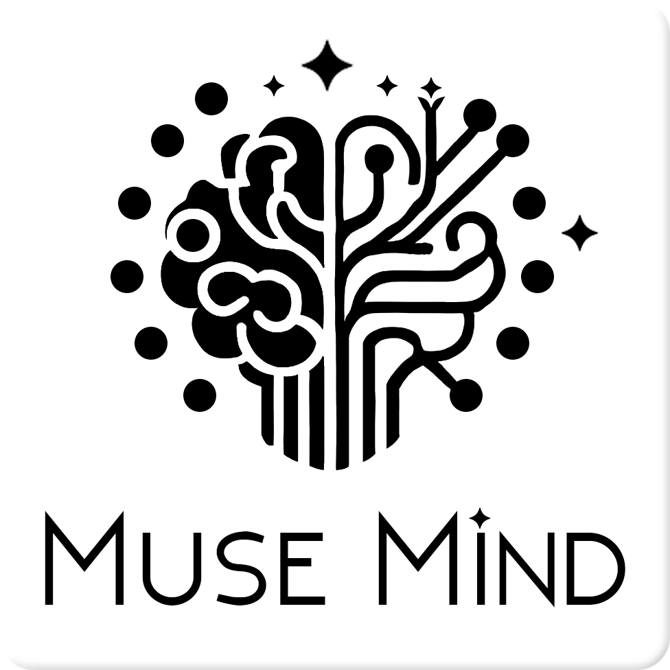

<p align="left">
  <a href="https://github.com/rkarmaka/muse-mind/blob/main/LICENSE">
    
  </a>
  
  
  
</p>


<p align="center">
  
</p>

# MuseMind

**A tiny local LLM-powered text-generator that surprises you with quirky stories and encourages curious exploration.**

---

## 🧠 Motivation

As a curious person at heart, I love learning about *random* things. But sometimes, it's hard to even know *what* to search for. So I built **MuseMind** to scratch that itch.

At its heart, MuseMind uses a small LLM — [Gemma-3-1B](https://developers.googleblog.com/en/introducing-gemma3/) — to automatically come up with a random idea and write a short, amusing story that gets you thinking. Whether you're bored, curious, or just need a spark, MuseMind is here to surprise and entertain you on your terminal or through a clean, minimalist UI.

It started as a fun CLI tool, but I decided to build a simple **Flask app** around it so that anyone can enjoy it via the browser. You can:

- 🔍 Enter a word/topic you’re curious about  
- 🎲 Hit **"Surprise Me"** for a random idea and story

Because it's using a tiny local LLM, it does hallucinate sometimes — but honestly, even those hallucinations can be hilarious and weirdly interesting. It’s all part of the fun; amusing and hence the name: **MuseMind** — part muse, part mind, part madness.

---

## 🎥 Demo
<p align="center">
  
</p>

---

## 🚀 Try It Out

Clone the repo and get started:

```bash
git clone https://github.com/rkarmaka/muse-mind.git
cd muse-mind
pip install -r requirements.txt
python app.py
```

**Note: You will need to get a *free* huggingface user access token. More information can be found [here](https://huggingface.co/docs/hub/en/security-tokens).**

## 💬 Get Involved
Use it, play with it, share it.

Found something funny?

Got an idea for improvement?

Found a bug?

Want to collab?

Feel free to open an issue, submit a PR, or just reach out directly. I'd love to hear from you!

## 📫 Contact
You can reach me via GitHub or [LinkedIn](https://www.linkedin.com/in/rkarmaka/).

Happy exploring! ✨